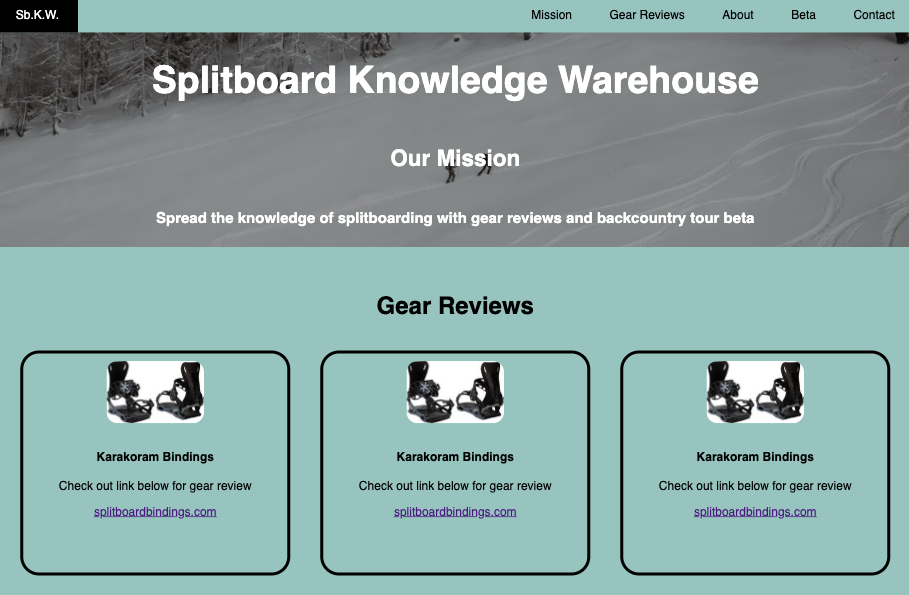

# Splitboard Knowledge Warehouse
> Sb.K.W. is a fictitious organization that aims to educate people about splitboarding with gear reviews and tour beta.  that This project was created to demonstrate the use of flex box in order to design a one page responsive website for a fictitious organization.

## Table of contents
* [General info](#general-info)
* [Screenshots](#screenshots)
* [Technologies](#technologies)
* [Setup](#setup)
* [Features](#features)
* [Status](#status)
* [Inspiration](#inspiration)
* [Contact](#contact)

## General info
>This project was designed to demonstrate the use of flex box to creat a responsive one page website.

## Screenshots


## Technologies
* HTML
* CSS
* JavaScript

## Setup
Please follow link to website - https://manovak24.github.io/splitboard_knowledge_warehouse/

## Code Examples
```html
<div class="about-container">
    <div class="crew-section">
      
      <div class="crew-name">
        <h4>Machete - Mark N.</h4>
        <a href="">Link to bio</a>
      </div>
      <p>"The myth. The man. The legend."</p>
      <p>Machete earned his name at Mt. Bohemia as a young grom learning how to survive the rugged backcountry terrain.</p>
    </div>

    <div class="crew-section">
      
      <div class="crew-name">
        <h4>Mike T - The Account Holder</h4>
        <a href="">Link to bio</a>
      </div> 
      <p>"Telemark Skier, but still cool"</p>
      <p>Mike T comes from a snowboard background, but recently made the switch to Telemark Skiing with hopes of becoming cool.</p>
    </div>
  </div>
```  

## Features
List of features ready and TODOs for future development
* Flex box responsive design
* Contact form

To-do list:
* Adding more gear reviews

## Status
Project is: _in progress_

## Inspiration
My love for splitboarding

## Contact
Created by [@manovak24](https://github.com/manovak24) - feel free to contact me!